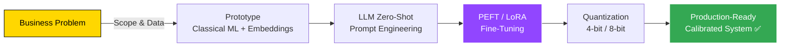

<!-- ===== HEADER BANNER ===== -->
<div align="center">


[](#)
[](#)
[](#)
[](#)
[](#)


[](https://github.com/<your-username>)
[](https://github.com/<your-username>)
[](https://github.com/<your-username>)

</div>

---

## 👋 About Me

I build **end-to-end AI systems** — from data preprocessing to deployment — with a focus on **practical NLP solutions** that solve real business problems.

> 🎯 **Recently shipped:** an AI-powered talent sourcing tool that ranks candidates using **fine-tuned Llama-3.1 + LoRA**, achieving recruiter-grade calibration on minimal hardware (single T4 GPU, ~8 min training).

```yaml
name:        Hongyu
role:        AI / NLP Engineer
location:    Canberra, Australia 🇦🇺
focus:
  - Large Language Models (LLMs) & Generative AI
  - Parameter-Efficient Fine-Tuning (LoRA / PEFT)
  - Semantic Search & Embedding Systems
  - HR-Tech & Talent Intelligence Tools
learning:    Agentic AI, RAG pipelines, model distillation
open_to:     Freelance · Full-time · Research collaborations
```

---

## 🧠 How I Work



---

## 🛠️ Tech Stack & Skills

### 💻 Languages & Core


### 🤖 Machine Learning & Deep Learning


### 🧠 NLP & LLMs


### 📊 Data & MLOps


### ☁️ Cloud & Tools


---

## 🚀 Featured Project — AI Talent Sourcing Engine

> **End-to-end NLP system that ranks job candidates for HR roles using LLMs and PEFT fine-tuning.**

<table>
<tr>
<td width="50%">

### 🎯 What It Does
- Scores candidate profiles **0–1** for HR-role fit
- Uses only **lightweight features**: title, location, network
- Mimics recruiter judgment **without labeled data**
- Outputs explainable, structured JSON rankings

</td>
<td width="50%">

### ⚙️ How It's Built
- **Part I:** TF-IDF, Word2Vec, GloVe, FastText, BERT + zero-shot LLM prompting
- **Part II:** Llama-3.1-8B fine-tuned with **LoRA + 4-bit quantization**
- Trained in **~8 min on a single T4 GPU**
- Achieves **calibrated scores (0.80–0.95)** vs. overconfident baselines

</td>
</tr>
<tr>
<td width="50%">

### 📈 Results
- High precision on explicit HR profiles (fit > 0.9)
- Fine-tuned model: better ranking granularity, reduced overconfidence
- Top candidates consistently surface "Aspiring HR", "HR Generalist", etc.

</td>
<td width="50%">

### 🧰 Stack


</td>
</tr>
</table>

📂 **[View the project →](https://github.com/<your-username>/<project-repo>)**


## 🌐 Connect With Me

<div align="center">

[](https://linkedin.com/in/<your-handle>)
[](mailto:<your-email@example.com>)
[](https://huggingface.co/<your-handle>)
[](https://kaggle.com/<your-handle>)
[](https://medium.com/@<your-handle>)
[](https://<your-portfolio>.com)

</div>

---

<!-- ===== SEO KEYWORDS ===== -->
<details>
<summary>🔍 <b>Keywords (for GitHub search visibility)</b></summary>

<br>

AI Engineer · NLP Engineer · Machine Learning Engineer · LLM Fine-Tuning · LoRA · PEFT · Hugging Face · Transformers · Llama · Sentence Transformers · Generative AI · RAG · Semantic Search · Python Developer · Data Scientist · HR Tech · Talent Intelligence · Canberra · Australia · Remote · Open to Work · Freelance AI Developer

</details>

---

<div align="center">


⭐ *If you find my work interesting, consider starring a repo or reaching out — I'd love to collaborate!* 🚀

</div>
